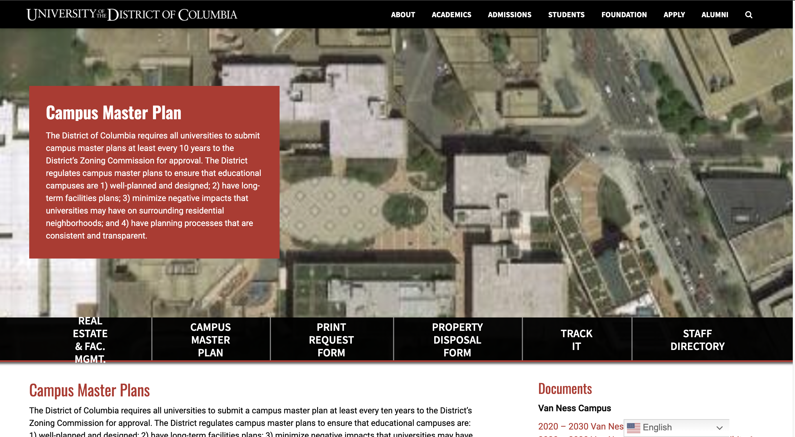

________________________________________________________________________________________________________________________

##### Hugh Smith and Monique Boyd
##### Human Computer Interaction
##### Assignment 2

________________________________________________________________________________________________________________________

#### Evaluation of UDC.EDU Using Design Guidelines and Principles


### Introduction
The <a href="https://www.udc.edu" target="_blank">University of the District of Columbia</a> Website came online almost 30 years ago, and I'm going to assume that for most of that time, UDC has had some presence on the web via a website. Today, we will investigate the website's current version and highlight three good and lousy design features. We will highlight all the guidelines they violate or adhere to using the guidelines, principles, and theories outlined in Chapter 2.

### Design Flaw - Inconsistent Navigational Bar


#### Guidelines Violated
According to [Schneiderman’s Eight Golden Rule](https://www.cs.umd.edu/users/ben/goldenrules.html), “…identical terminology should be used in prompts, menus, and help screens; and consistent color, layout, capitalization, fonts, and so on, should be employed throughout.” The UDC website violates the this rule as well as the National Cancer Institute Digital Standards. We observed several instances of inconsistent menu bars on the UDC website that contravene these principle. In the highlighted image above, it is evident that the menu bar changes when navigating between pages.

The military page on the UDC website [www.udc.edu/military](www.udc.edu/military) offers crucial information to veterans and active military personnel. However, upon accessing the Veteran Service Organization page, we noticed discrepancies in the menu bar text size and color scheme, which differ from other pages. This inconsistency makes it challenging for users to navigate the site reliably.

Such inconsistencies can particularly confuse novice users, who may need to re-acquaint themselves with the interface on each page. This results in increased cognitive load diminished usability, and potential user frustration due to unpredictable navigation.

#### Supporting Principles and Theories
- [Shneiderman’s Rule](https://www.cs.umd.edu/users/ben/goldenrules.html): Striving for consistency ensures that users do not need to adjust their mental model for similar tasks or actions across a system.
- [NCI Digital Standards](https://www.cancer.gov/digital-standards): Consistent navigation patterns reduce cognitive load and ensure accessibility for all users.

#### Recommendations
- Standardize the Menu Bar: Use the same layout, color scheme, and terminology for the menu bar across all pages.
- Follow a Consistent Menu Order: Ensure menu items appear in the same sequence throughout the site.
- Test with Users: Conduct usability testing to confirm that the new menu design is intuitive and accessible for all user groups.


### Design Flaw - Blurred Image


### Guidelines Violated
The UDC website contains numerous images essential for conveying the message of each functional unit of the University. To effectively communicate these messages, the images must be high quality and visually pleasing. However, [UDC’s Campus Master Plan Page](https://www.udc.edu/facilities/campus-master-plan/) does not adhere to several design guidelines. These include the [National Cancer Institute’s Visual Standards](https://www.cancer.gov/digital-standards), which mandate that visual elements be professional and aesthetically pleasing, ensuring clarity and accessibility.
Additionally, the page violates [Web Content Accessibility Guidelines (WCAG) 1.4.5](https://www.w3.org/WAI/WCAG21/quickref/#images-of-text) (Images of Text): If an image contains text that becomes illegible due to blurriness, it directly contravenes accessibility standards. Lastly, it breaches [Shneiderman’s Rule 3](https://www.cs.umd.edu/users/ben/goldenrules.html) (Offer Informative Feedback): "Blurred images fail to convey clear, accurate information, diminishing the website’s usability." They images detract from a website's overall quality and professionalism, leading to multiple negative effects. They undermine the user's trust and confidence in the website. When unclear images, users might perceive the website as poorly maintained or untrustworthy, which can drive them away.

#### Supporting Principles and Theories

- [National Cancer Institute’s Visual Standards](https://www.cancer.gov/digital-standards), which mandate that visual elements be professional and aesthetically pleasing, ensuring clarity and accessibility.
- [Web Content Accessibility Guidelines (WCAG) 1.4.5](https://www.w3.org/WAI/WCAG21/quickref/#images-of-text) (Images of Text): If an image contains text that becomes illegible due to blurriness, it directly contravenes accessibility standards.
- [Shneiderman’s Rule 3](https://www.cs.umd.edu/users/ben/goldenrules.html) (Offer Informative Feedback): Blurred images fail to convey clear, accurate information, diminishing the website’s usability.


#### Recommendations
- Replace Blurred Images: Ensure that high-resolution versions of images are uploaded and optimized for web use. Utilize formats such as PNG or JPEG with appropriate compression to maintain clarity.
- Use Scalable Formats: Consider employing vector graphics (SVG) for diagrams, charts, or logos to guarantee sharpness across various devices and resolutions.
- Test on Different Screens: Verify image quality across multiple devices, including desktops, tablets, and smartphones, to ensure consistency.


### Design Flaw - Missing Form Labels


### Guidelines Violated
The University’s website contains an extensive collection of crucial forms for business operations and student services. These forms ensure standardized data entry, essential for proper data management. The design of these forms plays a significant role in accessibility, as correctly formatted structures are necessary for screen readers and autofill suggestions to function effectively. The [Center For The Advancement of Learning’s Blackboard Course Restoration Form](https://www.udc.edu/cal/request-to-restore-blackboard-course/) violates several design guidelines rules, including the [Web Content Accessibility Guidelines (WCAG) 3.3.2](https://www.w3.org/WAI/WCAG21/quickref/#labels-or-instructions), which "requires that labels or instructions are provided when content requires user input." The intent is to ensure that users, especially those with disabilities, can understand what input is expected. In this case, it is important to ensure that screen readers can interpret the form well. In the Screenshot, we tested a screen reader’s ability to assess these form fields, and it could not read those fields due to missing labels. In addition to violating the WCAG guideline, this form violates the [United States Rehabilitation Act of 1973, Section 508](https://www.section508.gov/), and the [National Cancer Institute’s Digital Standards: Form Labels](https://www.cancer.gov/digital-standards/web-standards/forms). 


#### Supporting Principles and Theories

- [Web Content Accessibility Guidelines (WCAG) 3.3.2](https://www.w3.org/WAI/WCAG21/quickref/#labels-or-instructions)- WCAG 3.3.2, also known as Success Criterion 3.3.2: Labels or Instructions, is part of the Web Content Accessibility Guidelines (WCAG). This criterion requires that labels or instructions are provided when content requires user input. 
- [United States Rehabilitation Act of 1973, Section 508](https://www.section508.gov/) - Section 508 of the Rehabilitation Act of 1973, as amended, is a set of standards that requires federal agencies to make their Information and Communication Technology (ICT) accessible to employees and members of the public who have disabilities
- [National Cancer Institute’s Digital Standards: Form Labels](https://www.cancer.gov/digital-standards/web-standards/forms) - These standards include federal accessibility requirements and best practices in web design, ensuring that form labels are clear and accessible

#### Recommendations
Correct the follow HTML code by providing a label to the form. 
Here is the existing code for the current form which does not have a ``label`` attribute.

```
<input size="40" maxlength="400" class="wpcf7-form-control wpcf7-text wpcf7-validates-as-required" 
       id="firs-name" aria-required="true" aria-invalid="false" value="" 
       type="text" name="first-name">
```

Here is the corrected code:

`````
<label for="firs-name">First Name:</label>
<input size="40" maxlength="400" class="wpcf7-form-control wpcf7-text wpcf7-validates-as-required" 
       id="firs-name" aria-required="true" aria-invalid="false" value="" 
       type="text" name="first-name">
`````
